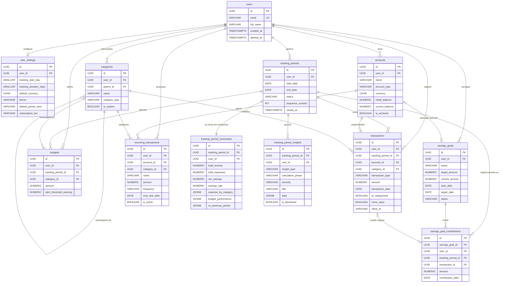

# Diagrama ER — Balvia (Data Operativa)

## Diagrama de Entidad-Relación



## Vista jerárquica de dominios

```
                  ┌─────────────────┐
                  │     users       │  (módulo Auth - placeholder)
                  └────────┬────────┘
                           │
            ┌──────────────┼──────────────┐
            │              │              │
            ▼              ▼              ▼
   ┌────────────────┐ ┌─────────┐ ┌─────────────┐
   │ user_settings  │ │accounts │ │ categories  │  (globales, no atadas a periodo)
   └────────────────┘ └─────────┘ └─────────────┘
            │              │              │
            ▼              │              │
   ┌──────────────────────────────────────────────┐
   │      tracking_periods (raíz temporal)        │
   └──────────┬──────────────────┬────────────────┘
              │                  │
              ├──────────────────┼────────────────┐
              ▼                  ▼                ▼
   ┌──────────────────┐ ┌──────────────┐ ┌──────────────────┐
   │   transactions   │ │   budgets    │ │   summaries +    │
   │                  │ │              │ │   insights       │
   └──────────────────┘ └──────────────┘ └──────────────────┘
              │
              ▼
   ┌──────────────────────┐    ┌────────────────────┐
   │ savings_goal_        │◄──►│   savings_goals    │ (independientes)
   │ contributions        │    └────────────────────┘
   └──────────────────────┘

   ┌─────────────────────────────────┐
   │   recurring_transactions        │ (independientes, generan transactions)
   └─────────────────────────────────┘
```

## Cardinalidades clave

| Relación | Cardinalidad | Nota |
|----------|--------------|------|
| user → tracking_periods | 1:N | Solo 1 activo a la vez (unique partial index) |
| user → user_settings | 1:1 | Configuración única por usuario |
| tracking_period → transactions | 1:N | Restrict on delete (no se puede borrar un periodo con transacciones) |
| tracking_period → summary | 1:1 | Solo al cerrar el periodo |
| tracking_period → insights | 1:N | Múltiples insights por periodo |
| tracking_period → budgets | 1:N | Presupuestos por categoría, replicados cada periodo |
| account → transactions | 1:N | Restrict on delete |
| category → transactions | 1:N | Set NULL on delete (preserva la transacción) |
| savings_goal → contributions | 1:N | Aportes desde múltiples periodos |
| transaction → contribution | 0..1:1 | Una transacción puede originar un aporte |
```
